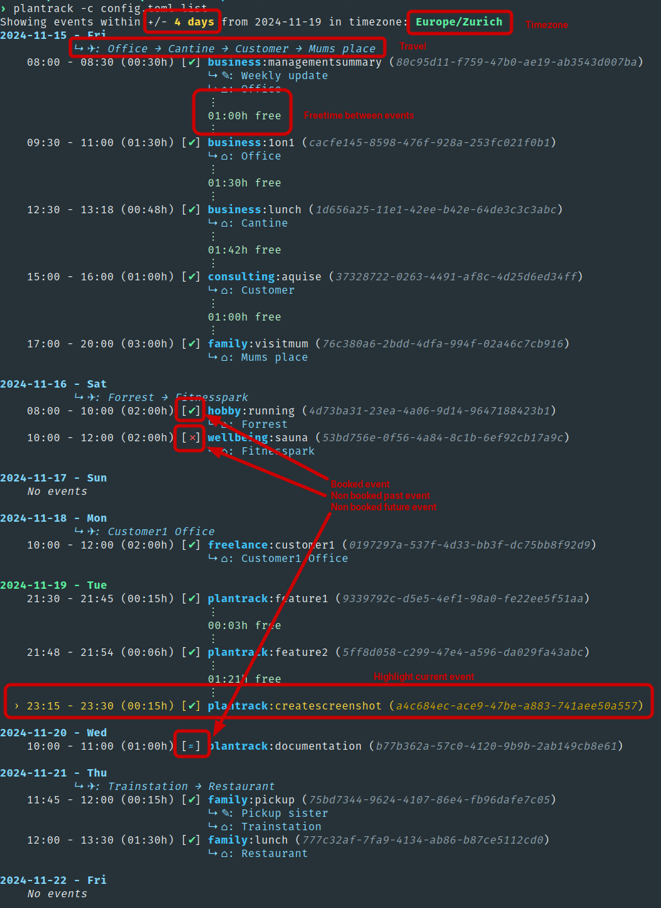

# plantrack: Planning and Tracking CLI

`plantrack` is CLI tool designed for planning and tracking time spent on projects and tasks. It allows to easily manage schedule, generate reports, and publish via ICS export.

## Why?
I was looking for a time planing and tracking tool to handle different projects with tasks, quickly generate reports, to see how much time I spent on different tasks within different projects, and being able to share my schedule with others, but also seeing my availability in the different workplace suites in my day to day life. The tool is not meant to schedule meetings with others (no invitations, no recurring events), but it is meant as a single point of availability.

## Features

* **Schedule Management:**
    * **Add:** Schedule events with detailed information, including project, task, time range, date, notes, location, and booking status.
    * **Quickadd:** Quickly add booked events for the current time with a specified duration.
    * **Modify:** Update existing events' details like location, notes, and booking status.
    * **Delete:** Remove events from your schedule.

* **Intelligent Scheduling:**
    * **Time Rounding:** Round event start and end times to a specified interval for cleaner scheduling. By default events are rounded to 15 minutes.
    * **Overlap Detection & Handling:** `plantrack` handles overlapping events, prompting you to resolve conflicts. Events are splitted to accommodate new entries.
    * **Event Merging:** Automatically merges contiguous events with the same project/task, notes, and location into single blocks.
    * **Timezone Support:** Events can be added and displayed in different timezones. Current timezone is read in the following priority: 1. CLI argument (`--timezone`), 2. `TZ` environment variable, 3. `timezone` in `config.toml`, 4. defaults to UTC.

* **Comprehensive Reporting:**
    * **Project-Based Reports:** Generate detailed reports for individual projects, summarizing planned and booked time per task.
    * **Target Time Comparison:**  Track your progress against target hours for a given project/period.

* **External Calendar Integration:**
    * **ICS Export:** Export your schedule to an ICS file for compatibility with various calendar applications.
    * **Custom Push Command:** Configure a command to automatically upload or synchronize your ICS file with external services.

* **Additional Utilities:**
    * **Free Slot Checking:** Check for availability within a specific time range.
    * **Data Cleanup:** Remove old events from your schedule.
    * **Travel:** Show travel routes per day

### Usage

```bash
› plantrack --help
Usage: plantrack [OPTIONS] <COMMAND>

Commands:
  add       Add a new event to the schedule
  quickadd  Quickly add a new booked event for the current time
  list      List all scheduled events
  report    Generate a report for a specific project
  free      Check if a time slot is free
  current   Show the current project:task
  push      Push by running a push_command if present in the config file
  cleanup   Remove events older than a specified number of days
  set       Modify an existing event
  delete    Delete an event by ID
  help      Print this message or the help of the given subcommand(s)

Options:
  -c, --config-file <CONFIG_FILE>  Path to the config file
  -r, --rounding <ROUNDING>        Rounding interval in minutes
  -t, --timezone <TIMEZONE>        Timezone for displaying events (e.g., "America/New_York")
  -h, --help                       Print help
  -V, --version                    Print version
```

**Examples:**

* Add a planned event: `plantrack add ProjectA:TaskB 14:00-16:00 --date 2024-11-18 --location "Office" --note "Discuss progress"`
* Add a booked event using quickadd:  `plantrack quickadd ProjectX:Meeting -m 30`
* Generate a report of Project4, compare with 40 hours and 45 minutes: `plantrack report ProjectA --month 11 --year 2024 --target 40.75`
* List events from 7 days ago to 7 days in the past:  `plantrack list -d 7`
* Check for free time: `plantrack free 09:00-10:00 --date 2024-12-25`
* Push changes to a remote calendar: `plantrack push`
* Clean up old events: `plantrack cleanup 90`


## Configuration

`plantrack` uses a TOML configuration file located at `$XDG_CONFIG_HOME/plantrack/config.toml` (typically `~/.config/plantrack/config.toml`).

**Example `config.toml`:**

```toml
schedule_file = "~/.local/share/plantrack/schedule.json"  # Customize paths as needed
ics_file = "~/.local/share/plantrack/schedule.ics"
rounding = 15 # Round events to 15 minutes
export_notes = false # Dont export notes to ICS
timezone = "Europe/London"  # Default timezone
push_command = "curl -T ~/.local/share/plantrack/schedule.ics https://your.calendar.server/upload" # Example: upload ICS to a server
```

## Screenshots
### plantrack list


## Concept
`plantrack` uses the syntax of `project:task` to title an event. This is not unique and can and should be used to group the same activity. Exporting to ICS removes the task part from the meeting title. There is no concept of all day nor recurring events.

A timespan is defined as starttime - endtime (e.g.: `09:00-10:00`), if no `--date` is defined, the event will be added to today.

Additional optional paramters:

* `--note`: Additional text for the event. The can be exported to ICS as description if `export_notes = true` is defined in the configfile.
* `--location`: A location of the event. This is always exported to ICS. I is also used for the daily travel in the `list` command.
* `--booked`: By default events are to `--booked=false`, which results in tentative meetings in ICS. `--booked=true` make the event confirmed in ICS.

Reporting is done per `project`, and listed by `task`. The report lists tasks and time spent for a month, by default the current month. Optional parameter is `--target`, which is used to set a target time per month to quickly verify if I underrun oder overrun the "budget".

## Todo
* Add tests
* Write proper user documentation
* Refactor code structure
* Move to a database from json to persist data?
* ICS Import?
